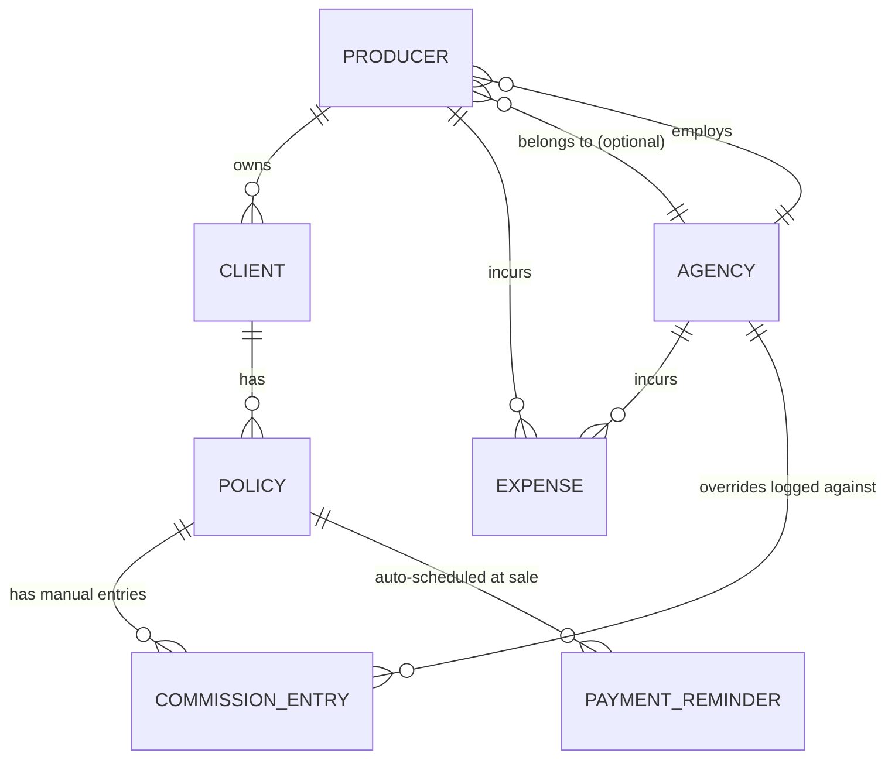

# BOB — Data Model & Commission Logic (v6 — final)

This is the schema and business rules to build against — finalized. Everything downstream — the importer's column mapping, the dashboard formulas, the Producer vs. Agency tier split — reads from this.

The commission model is a simple manual ledger: the agent or agency owner enters what actually got paid (advance, additional payments, chargebacks, overrides) rather than BOB calculating it from a formula. This is more forgiving of how carriers actually pay in practice.

## Entity relationship



A **Producer** account with no agency is the Individual tier. An **Agency** wraps one or more Producers and unlocks override entries, staff costs, and recruiting costs on top of everything a Producer tracks.

## Schema (Postgres)

```sql
create table agency (
  id         uuid primary key default gen_random_uuid(),
  name       text not null,
  created_at timestamptz default now()
);

create table producer (
  id                 uuid primary key default gen_random_uuid(),
  agency_id          uuid references agency(id),   -- null = individual tier, self-contained
  name               text not null,
  subscription_tier  text not null check (subscription_tier in ('individual','agency_owner')),
  created_at         timestamptz default now()
);

create table client (
  id           uuid primary key default gen_random_uuid(),
  producer_id  uuid not null references producer(id),
  name         text not null,
  contact_info jsonb,
  created_at   timestamptz default now()
);

create table policy (
  id              uuid primary key default gen_random_uuid(),
  client_id       uuid not null references client(id),
  policy_number   text,                       -- carrier's app # / policy #, when available
  carrier         text not null,
  product_type    text not null,             -- Term, Whole Life, IUL, Final Expense, Annuity
  face_amount     numeric(12,2),
  monthly_premium numeric(10,2) not null,
  annual_premium  numeric(10,2) generated always as (monthly_premium * 12) stored,
  issue_date      date not null,
  status          text not null check (status in ('active','pending','lapsed','declined','withdrawn')),
  lead_type       text,                       -- descriptive only, e.g. 'FEX', 'IUL lead'
  lead_vendor     text,                       -- descriptive only, e.g. 'Happy Agent', 'FFL CRM'
  created_at      timestamptz default now()
);

-- Single manual ledger for everything commission-related: advances, additional payments,
-- chargebacks, and agency overrides all live here, distinguished by entry_type and owner_type.
create table commission_entry (
  id           uuid primary key default gen_random_uuid(),
  policy_id    uuid not null references policy(id),
  owner_type   text not null check (owner_type in ('producer','agency')),
  owner_id     uuid not null,                 -- producer_id or agency_id depending on owner_type
  entry_type   text not null check (entry_type in ('advance','additional','chargeback','override','other')),
  amount       numeric(10,2) not null,        -- chargebacks entered as negative amounts
  entry_date   date not null,
  notes        text,
  created_at   timestamptz default now()
);

-- Auto-generated when a policy is created: one reminder row for each of months 10, 11, 12, 13
-- after issue, so nothing falls through the cracks around the year-end payment window.
create table payment_reminder (
  id                uuid primary key default gen_random_uuid(),
  policy_id         uuid not null references policy(id),
  months_after_issue int not null check (months_after_issue in (10,11,12,13)),
  reminder_date     date not null,            -- issue_date + months_after_issue, computed once at creation
  status            text not null default 'pending' check (status in ('pending','completed','dismissed')),
  created_at        timestamptz default now()
);

create table expense (
  id            uuid primary key default gen_random_uuid(),
  owner_type    text not null check (owner_type in ('producer','agency')),
  owner_id      uuid not null,                -- producer_id or agency_id depending on owner_type
  category      text not null check (category in ('lead_cost','operations','staff','recruiting','travel')),
  description   text,
  vendor        text,                         -- e.g. lead vendor name; null outside lead_cost
  quantity      int,                          -- e.g. # of leads; null where not applicable
  unit_cost     numeric(10,2),                -- e.g. cost per lead; null where not applicable
  amount        numeric(10,2) not null,
  expense_date  date not null
);
```

Two things to enforce in the app layer (SQL check constraints can't easily express these without a lookup):
- `override` entries should only ever have `owner_type = 'agency'`.
- `staff` and `recruiting` expense categories should only ever have `owner_type = 'agency'` — an Individual producer shouldn't see those options at all.

`commission_entry.entry_type` includes `'other'` for one-off adjustments that don't cleanly fit advance/additional/chargeback/override — confirmed.

## Payment reminders

When a policy is created with `issue_date = D` **and `status = 'active'`**, the app inserts four rows into `payment_reminder` automatically (a `pending` or `declined` application isn't a paid-up policy yet, so it gets no reminders until/unless its status is updated to `active`):

```
reminder_date = D + 10 months   (months_after_issue = 10)
reminder_date = D + 11 months   (months_after_issue = 11)
reminder_date = D + 12 months   (months_after_issue = 12)
reminder_date = D + 13 months   (months_after_issue = 13)
```

These are pure reminders — they don't calculate or predict an amount, they just surface on the dashboard ("3 policies have expected payments due this month") so a payment doesn't quietly get missed around the year-end window.

**Auto-dismiss rule (confirmed):** when a new `commission_entry` with `entry_type = 'additional'` is inserted for a policy, the app finds that policy's earliest still-`pending` `payment_reminder` and sets it to `completed` automatically — one match per entry, oldest pending reminder first. The agent can still dismiss a reminder manually (status `dismissed`) if a payment isn't coming, e.g. the policy lapsed before reaching that month.

## How this plays out in the UI

For a given policy, the agent (or agency owner, on the agent's behalf) logs entries as they happen:
1. **Advance** — the upfront payment when the policy issues.
2. **Additional** — further payments as they arrive, prompted by the month 10–13 reminders above but not restricted to them.
3. **Chargeback** — entered as a negative amount whenever a carrier statement shows one, offsetting the total earned on that policy.
4. **Override** (agency tier only) — the agency owner logs what they were actually paid as an override on a producer's policy.

There's no calculated commission rate anywhere in this model. The premium fields exist for reporting (e.g. "average premium per policy," "premium in force") but don't drive any commission math — the ledger is the source of truth for money earned.

## Profitability formulas

**Individual Producer:**
```
Total Commission = SUM(commission_entry.amount WHERE owner_type='producer' AND entry_type IN ('advance','additional','chargeback','other'))
                    -- chargebacks are already negative, so this nets automatically
Net Profit = Total Commission
           - SUM(expense.amount WHERE owner_type='producer' AND category IN ('lead_cost','operations'))
```

**Agency Owner** (adds overrides, staff, recruiting on top, rolled up across every producer under the agency):
```
Total Producer Commission = SUM(commission_entry.amount WHERE owner_type='producer' AND entry_type IN ('advance','additional','chargeback','other'))
                             -- across all producers under this agency
Total Overrides = SUM(commission_entry.amount WHERE owner_type='agency' AND entry_type='override')
Net Profit = Total Producer Commission + Total Overrides
           - SUM(expense.amount WHERE category IN ('lead_cost','operations','staff','recruiting'))
```

## CSV import — column mapping logic

Most agents' existing trackers have one row per policy with client info, policy info, and often a premium or commission figure all mixed into the same row. Import needs to (a) guess a sensible mapping from whatever headers the file actually has, (b) let the agent confirm or fix it before anything is written, and (c) split that one row across `client`, `policy`, `commission_entry`, and `payment_reminder` correctly.

**Step 1 — Read headers, suggest a mapping.**
Match each of the file's column headers against a synonym list per target field, case-insensitively, ignoring punctuation/whitespace. First match wins; nothing is forced.

| Target field | Synonyms to match against |
|---|---|
| `client.name` | client, client name, customer, insured, policyholder, name, full name |
| `client.contact_info` (phone) | phone, phone number, cell, mobile |
| `client.contact_info` (email) | email, email address |
| `policy.carrier` | carrier, company, insurer, ins co |
| `policy.policy_number` | app #, policy #, app #/policy #, policy number, app number |
| `policy.product_type` | product, product type, plan, plan type, policy type |
| `policy.face_amount` | face amount, face, coverage, coverage amount, death benefit |
| `policy.monthly_premium` | monthly premium, premium/mo, premium (monthly), monthly prem |
| `policy.annual_premium`* | annual premium, annual prem, yearly premium, ap, total ap |
| `policy.issue_date` | issue date, issued, effective date, policy date, start date, approved date, submit date |
| `policy.status` | status, policy status |
| `policy.lead_type` / `policy.lead_vendor` | lead type, lead vendor, lead source |
| `commission_entry.amount` (advance) | commission, advance, comp, commission paid, initial commission, advance commission |
| `commission_entry.amount` (additional) | final commission, additional commission, renewal |
| `commission_entry.amount` (chargeback) | chargeback, charge back, charge back amount |

*If the file only has `annual_premium` and not `monthly_premium`, the importer divides by 12 to populate `monthly_premium` (the schema's actual stored field) rather than skipping the column — flagged in the mapping preview so the agent can verify the math rather than it happening silently.

**Step 2 — Confirm-before-commit preview** (matches the mockup's mapping screen).
Show the suggested mapping as editable dropdowns per target field, each defaulting to its best-guess column but changeable to any column in the file or "— skip —." Render the first 3 rows under the mapping as a live preview so the agent can see real values landing in the right place before committing.

**Step 3 — Row-by-row import logic.**
```
for each row in file:
    client = find_or_create(client, match on name, scoped to this producer)
    policy = create(policy, using mapped carrier/product_type/face_amount/
                     monthly_premium/issue_date/status, linked to client)

    generate 4 payment_reminder rows for months 10/11/12/13 after issue_date
                     (same auto-generation as manual entry — import doesn't skip this)

    if a commission amount column was mapped and has a value:
        create commission_entry(policy_id, owner_type='producer', owner_id=current_producer,
                                 entry_type='advance', amount=mapped_value,
                                 entry_date=issue_date, notes='Imported from CSV')
```

**Step 4 — Import summary, not silent success.**
After committing, show a plain count: "Imported 42 policies, 42 clients (3 matched to existing clients), 42 commission entries, 168 payment reminders scheduled." Any row that's missing a required field (no client name, no premium, no issue date) is skipped and listed separately with its row number, rather than silently dropped or guessed at.

## Mapping against your real tracker

Your workbook has 12 tabs. Most are either raw data (map directly to a table) or computed rollups (skip — BOB's dashboard recalculates these automatically from the ledger). Here's how each one lands:

| Tab | What it is | Maps to |
|---|---|---|
| **Applications Submitted** | Every application, one row each, with client/policy/commission fields all together | `client` + `policy` + `commission_entry` — see detailed mapping below |
| **Lead Order Costs** | Lead vendor, count, cost/lead, order total | `expense` (category `lead_cost`) — richer than a flat amount, see below |
| **Expenses (excluding lead costs)** / **OpEx Costs data baseline** | Recurring subscriptions/fees (Verizon, Google Workspace, E&O insurance, etc.) | `expense` (category `operations`) — these are two copies of the same shape |
| **STAFF COSTS** | Hours per week per role (Appointment Setter, Admin Assistant) × a cost-per-hour rate | `expense` (category `staff`) — needs a decision, see below |
| **Recruiting Costs** | Currently empty | `expense` (category `recruiting`) — nothing to import yet, category already supported |
| **TRAVEL COSTS** | Per-trip breakdown (hotel, flights, food, transport) | Not currently a category — see below |
| **OWNERS DRAW** | Monthly total the owner pulled out of the business | Not an expense at all — see below |
| WOW Applications Submitted, MOM apps submitted, OPEX, Income Statement | Weekly/monthly/annual rollups of the data above | **Skip.** These are exactly what BOB's dashboard will generate live from the ledger tables — importing them would just create duplicate, stale numbers. |

### Applications Submitted → client / policy / commission_entry

Your actual headers map cleanly onto the schema, with a couple of additions worth making:

| Your column | Target |
|---|---|
| FULL NAME | `client.name` |
| PHONE NUMBER, EMAIL / EMAIL.1 | `client.contact_info` (jsonb) |
| CARRIER | `policy.carrier` |
| APP #/ POLICY # | **new field** `policy.policy_number` |
| POLICY TYPE | `policy.product_type` |
| COVERAGE AMOUNT | `policy.face_amount` |
| MONTHLY PREMIUM | `policy.monthly_premium` |
| APPROVED DATE (fallback: SUBMIT DATE) | `policy.issue_date` |
| STATUS | `policy.status` — needs an expanded set of values, see below |
| LEAD TYPE, LEAD VENDOR | **new fields** `policy.lead_type`, `policy.lead_vendor` — descriptive only (see note below) |
| Advance Commission (fallback: ISSUE PAID AMOUNT (ADVANCE)) | `commission_entry` row, `entry_type='advance'` |
| Final Commission | `commission_entry` row, `entry_type='additional'` |
| CHARGE BACK AMOUNT | `commission_entry` row, `entry_type='chargeback'`, stored negative |
| NOTES | `commission_entry.notes` |
| TOTAL EXPECTED COMMISSION, Total Paid Commission, Remaining Balance | **Skip on import.** These are the exact numbers BOB computes automatically from the ledger — importing them would duplicate what the app already derives. |

**Four real gaps this surfaced:**

1. **Status values don't match the schema's 3-value enum.** Your tracker has Approved, Pending, Declined, Withdrawn, Cancelled, Refused, PAID, and blank. A "Declined" or "Refused" application never became a policy at all — that's a different situation from an active policy that later "Lapsed." Recommend expanding `policy.status` to `active, pending, lapsed, declined, withdrawn` (PAID and Approved both map to `active`), and only auto-generating `payment_reminder` rows for `active` policies — a declined application doesn't need year-1 payment reminders.

2. **LEAD TYPE / LEAD VENDOR live on the policy row, not tied to a specific lead-cost expense.** This is genuinely useful — it's how you'd eventually calculate ROI per lead source (spend from Lead Order Costs vs. commission earned from policies tagged with that vendor) — but it's a *description*, not a database relationship, since your lead spend is tracked as a batch order (35 leads for $875), not per-client. Recommend keeping it as plain descriptive text on the policy rather than trying to force a real foreign-key link to a specific expense row.

3. **Disposition text lands in numeric columns for about a quarter of your rows** (187 of 738) — the "MONTHLY PREMIUM" cell doesn't contain a number at all, it contains the application's outcome instead ("Approved", "Declined", "Refused - no bank account," "Cancelled due to non payment"). This happened because when an application never issued, there was nowhere else on the row to note why, so the disposition got typed into the premium cell instead of the STATUS column, which was left blank. A naive column-copy import would either crash on these rows or silently write garbage into a numeric field.

   The importer needs a **type-check-and-recover step**, not just a straight column copy: for every row, if a field mapped to a numeric column (premium, face amount, commission amounts) doesn't parse as a number, don't fail the row — check the text against a small keyword list (approved, declined, pending, cancelled, withdrawn, refused) and use it to fill `policy.status` when the STATUS column itself was blank, leaving the numeric field null. Anything that doesn't match a known keyword goes into the "skipped rows" list in the import summary for a human to look at, with the row number and the raw text shown — never silently coerced to zero or dropped without a trace.

4. **Roughly two-thirds of rows are sparse, application-only records** (480 of 738 have a client name but blank data almost everywhere else) — these look like logged applications that never resulted in a real policy conversation continuing (no carrier, no premium, no outcome recorded). Worth deciding: should every row become a `policy` record regardless of how sparse it is, or should rows missing a carrier *and* a premium be excluded from the policy table entirely and logged in the import summary as "incomplete records, not imported" rather than cluttering the book of business with hundreds of near-empty policies?

### Lead Order Costs → expense (richer than a flat amount)

Your lead costs track SOURCE, LEAD TYPE, # OF LEADS, and COST PER LEAD alongside the order total — more structured than a generic description field. Recommend adding optional columns to `expense`: `vendor` (text), `quantity` (int), `unit_cost` (numeric) — populated for `lead_cost` rows, left null for everything else. This preserves your ability to compare cost-per-lead across vendors over time, which a flat "$875, Happy Agent leads" description would lose.

### STAFF COSTS → resolved as a simple dollar entry

Your sheet logs **hours per week** per role against a **cost-per-hour rate** (e.g., Admin Assistant: 40 hrs × $8/hr = $320/week) — it's not a flat dollar figure being manually entered. Decision: keep this consistent with the "just log what you were paid" ledger philosophy used everywhere else. The importer computes `hours × rate` once at import time and writes a single dollar `expense` row per week per staff member; going forward, the agency owner enters the week's total dollar cost directly, the same as any other expense. If a future version needs hours and rate as real tracked fields, that's a clean addition later without disturbing anything already built.

### TRAVEL COSTS → new category, or fold into Operations?

Your travel tracking is per-trip (hotel, flights, food, transportation as line items under a trip name). The schema's `expense.category` doesn't currently have a travel option. Recommend adding `'travel'` as a fifth category, with the trip name in `description` — cleaner than lumping it into `operations` where it'd get lost among recurring subscriptions.

### OWNERS DRAW → not a business expense

A draw is the owner taking already-earned profit out of the business — it doesn't reduce profitability, it just reduces cash on hand. Recommend a separate table, kept out of the Net Profit formula entirely:
```sql
create table owner_draw (
  id         uuid primary key default gen_random_uuid(),
  agency_id  uuid not null references agency(id),
  amount     numeric(10,2) not null,
  draw_date  date not null,
  notes      text
);
```
This could still surface on the dashboard as a separate "cash out this month" line for visibility, just not netted against Net Profit.

## Finalized decisions

These were left open in earlier drafts. Closing them out with sensible defaults so the spec is buildable — each one is a small, low-cost thing to revisit later if it turns out wrong in practice:

- **Client matching on import: exact name match, scoped to the current producer.** No fuzzy matching in v1. If two rows produce near-duplicate names ("Bob Smith" vs. "Robert Smith"), they'll create two client records — acceptable for v1 since it's easy to merge manually later, and fuzzy matching risks silently merging two different people, which is worse than a duplicate.
- **Multiple policies per client, same file: one client record, all matching policies attached to it** — matched by exact name within that producer's import.
- **Staff costs: simple pre-multiplied dollar entry (option a).** This stays consistent with the rest of the ledger — no calculated fields anywhere else, so staff costs shouldn't be the exception. If an agency later wants hours × rate as real tracked fields, that's a clean v2 addition without touching anything else in the schema.
- **Travel is its own expense category** (`'travel'`, already reflected in the `expense` table above), not folded into Operations — confirmed.
- **"Total expected commission" is not carried into the schema.** Consistent with the manual-ledger philosophy: BOB tracks what was actually paid, not an estimate alongside it. If you want to jot an expected figure for your own reference, that's what the `notes` field on a `commission_entry` is for — it just isn't a structured, reportable field.
- **Sparse, application-only records (no carrier and no premium) are excluded from the `policy` table on import**, not created as near-empty policies. They're listed in the import summary as "incomplete records, not imported" so nothing is silently lost — but they don't clutter the book of business. A user can always add a real policy later once there's an actual carrier and premium to record.
- **The disposition-text-recovery approach stands as designed:** numeric fields that fail to parse are checked against the status keyword list first, and only fall through to the "skipped rows" list if no keyword matches.

## Status: ready for build

This spec — schema, commission ledger logic, payment reminders, and import mapping (including the real-world edge cases the reference file surfaced) — is complete enough to hand to Claude Code as the actual build spec: database, API, auth, Stripe billing for the two subscription tiers, the CSV/XLSX importer, and the real UI built out from the BOB mockup.
